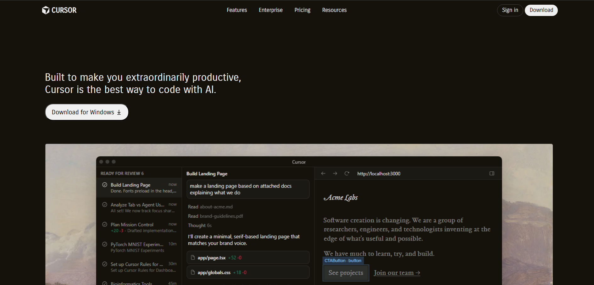
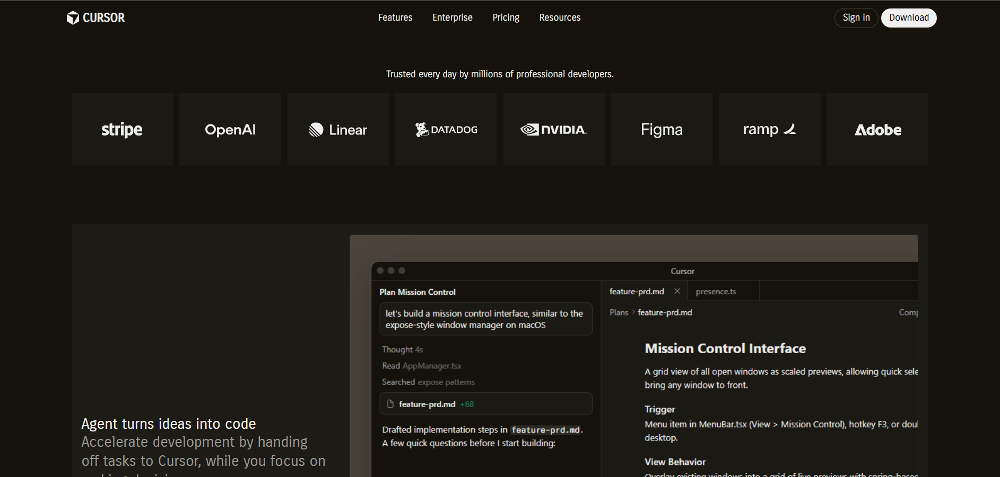
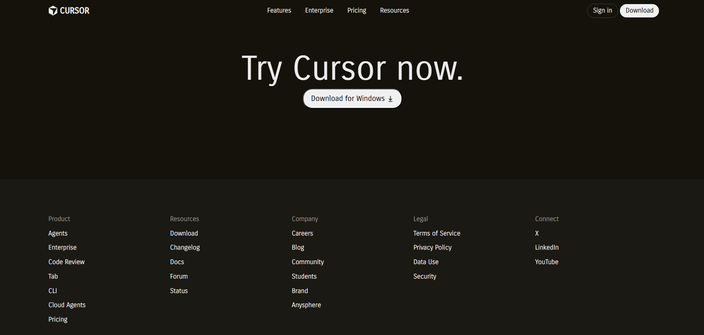

# cursor-landing-page
A clone of cursor landing page using html &amp; css

## Getting Started
Follow these steps to run the project locally.

1. Clone the repository:
   ```bash
   git clone https://github.com/Sum4nG/cursor-landing-page.git
   ```
2. Navigate to the project directory:
   ```bash
   cd cursor-landing-page
   ```
3. Open the `index.html` file in your web browser to view the landing page.

## Screenshots




